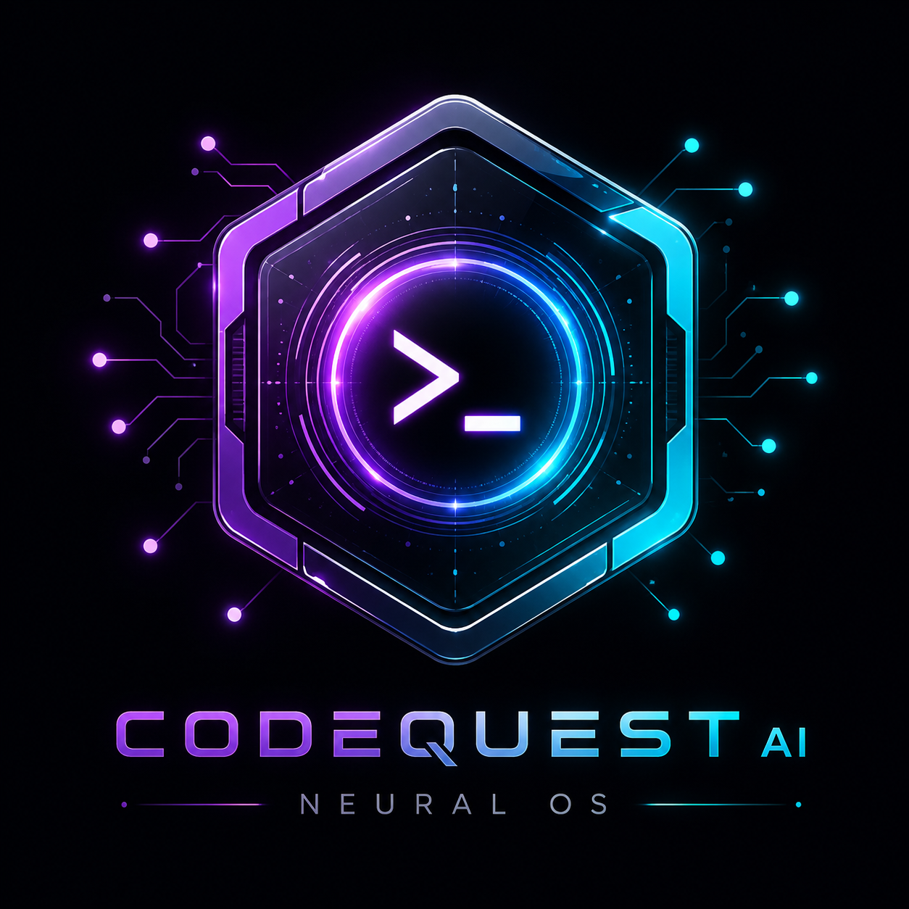
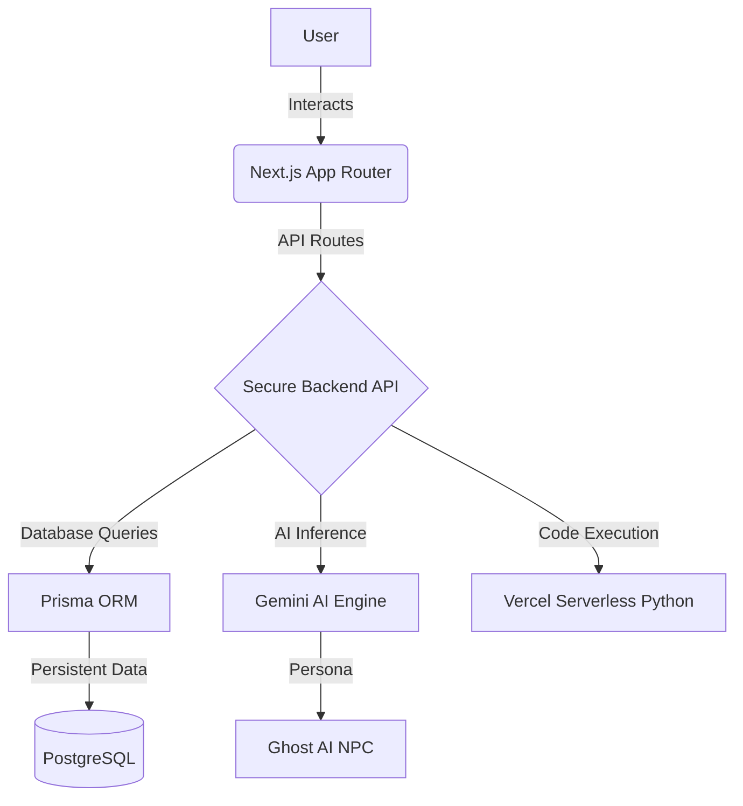

<div align="center">
  
  
  # CodeQuest AI
  **A narrative-driven cyberpunk AI operating system where you learn Python through interactive missions.**
  
  [](https://opensource.org/licenses/MIT)
  [](#)
  [](#)
  [](#)
  [](#)
  [](#)

  [Live Demo](#) · [Documentation](#) · [Report Bug](#) · [Request Feature](#)
</div>

<br />

<div align="center">
  
</div>

<br />

## ⚡ What is CodeQuest AI?

CodeQuest AI is not just another coding platform—it is a **narrative-driven AI operating system**. 

We grew tired of boring video tutorials and sterile, static coding environments. Instead of watching someone else code, players become Agents inside the neon-lit, dystopian **Neural City**. To progress, you must hack corporate AI systems, solve programming challenges, interact with dynamic AI NPCs, and unlock restricted districts.

CodeQuest AI seamlessly fuses **premium gamification, AI-driven mentorship, and an immersive cyberpunk storyline** into an entirely new way to master Python.

---

## 🎯 Why CodeQuest?

Traditional coding education is fundamentally broken. Here is how we fix it.

| Feature | Normal Coding Platform | CodeQuest AI |
| :--- | :---: | :---: |
| **Learning Format** | Watch videos ❌ | Live AI Missions ✅ |
| **Environment** | Static Exercises ❌ | Interactive Story ✅ |
| **Engagement** | Boring tests ❌ | XP + Levels + Badges ✅ |
| **Assistance** | Read the docs ❌ | Live AI Mentor (Ghost) ✅ |
| **Aesthetics** | Sterile UI ❌ | Cyberpunk Neural OS ✅ |

---

## ✨ Features

<table>
  <tr>
    <td>
      <strong>🤖 AI Story Engine</strong><br/>
      The world reacts to your code. Interactions and challenges are dynamically driven by our AI engine.
    </td>
    <td>
      <strong>⚔️ Interactive Missions</strong><br/>
      Solve practical Python challenges—from basic data types to advanced vector operations.
    </td>
  </tr>
  <tr>
    <td>
      <strong>💻 Python Sandbox</strong><br/>
      A live, sandboxed code execution environment directly in your browser.
    </td>
    <td>
      <strong>👻 AI Mentor</strong><br/>
      Meet "Ghost", your AI NPC companion who guides you, hints at solutions, and reacts to your progress.
    </td>
  </tr>
  <tr>
    <td>
      <strong>🗺️ District Progression</strong><br/>
      Unlock new areas of Neural City as you level up your skills and complete story arcs.
    </td>
    <td>
      <strong>📈 XP System</strong><br/>
      Earn experience points for every successful hack, optimal solution, and completed mission.
    </td>
  </tr>
  <tr>
    <td>
      <strong>🏆 Achievements</strong><br/>
      Unlock exclusive badges and showcase your prowess on the Neural Grid.
    </td>
    <td>
      <strong>🎨 Cyberpunk UI</strong><br/>
      A premium, glassmorphism-heavy OS interface designed with Framer Motion.
    </td>
  </tr>
  <tr>
    <td>
      <strong>🔒 Authentication</strong><br/>
      Secure military-grade login via Better Auth and Google OAuth.
    </td>
    <td>
      <strong>👑 Leaderboard</strong><br/>
      Compete against other rogue agents globally for the top spot.
    </td>
  </tr>
</table>

---

## 📸 Screenshots

<details>
<summary><b>Landing Page</b></summary>
<br/>

</details>

<details>
<summary><b>Dashboard</b></summary>
<br/>

</details>

<details>
<summary><b>District Map</b></summary>
<br/>

</details>

<details>
<summary><b>Mission Terminal</b></summary>
<br/>

</details>

<details>
<summary><b>Ghost AI</b></summary>
<br/>

</details>

<details>
<summary><b>Authentication</b></summary>
<br/>

</details>

---

## 🎥 Demo

<div align="center">
  
</div>

---

## 🏗️ Architecture

CodeQuest AI uses a modern, scalable, and decoupled architecture.



---

## 📂 Folder Structure

A highly organized, maintainable, and scalable project structure.

```text
codequest-ai/
├── api/               # Vercel serverless execution endpoints
├── app/               # Next.js 15 App Router routes and layouts
├── components/        # Reusable UI elements (HUDs, Modals, Forms)
├── lib/               # Utility functions, auth clients, and API wrappers
├── hooks/             # Custom React hooks
├── prisma/            # Database schema and seed scripts
├── public/            # Static assets (images, logos, fonts)
├── styles/            # Global CSS and Tailwind configurations
└── types/             # Global TypeScript definitions
```

---

## 🛠️ Tech Stack

| Category | Technology |
| :--- | :--- |
| **Framework** | Next.js 15 App Router (React 19) |
| **Authentication** | Better Auth |
| **Database** | PostgreSQL |
| **ORM** | Prisma ORM |
| **AI Integration** | Google Gemini API |
| **Styling & Animations** | Tailwind CSS + Framer Motion |
| **Deployment** | Vercel |
| **Package Manager** | npm |

---

## 🚀 Installation

Follow these steps to deploy Neural City on your local machine.

### 1. Clone the repository
```bash
git clone https://github.com/Divyanshu-2907/CodeQuest-AI.git
cd CodeQuest-AI
```

### 2. Install dependencies
```bash
npm install
```

### 3. Set up Environment Variables
Copy the example environment file and configure it.
```bash
cp .env.example .env
```

### 4. Initialize the Database
Push the schema and seed the initial missions.
```bash
npx prisma db push
npx tsx --env-file=.env prisma/seed.ts
```

### 5. Run the Local Grid
```bash
npm run dev
```

---

## 🔑 Environment Variables

| Variable | Purpose | Required | Example |
| :--- | :--- | :---: | :--- |
| `DATABASE_URL` | PostgreSQL connection string | ✅ | `postgresql://neondb_owner:...` |
| `BETTER_AUTH_SECRET` | Security key for session encryption | ✅ | `super_secret_string_123` |
| `BETTER_AUTH_URL` | Base URL for auth callbacks | ✅ | `http://localhost:3000` |
| `GEMINI_API_KEY` | Key for Ghost NPC and AI generation | ✅ | `AIzaSy...` |

---

## 🗺️ Project Workflow

1. **Login:** Users authenticate via the military-grade `CinematicLoginCard`.
2. **Onboarding:** New agents are introduced to Neural City's lore.
3. **District Map:** An interactive 3D/parallax map showing unlocked sectors.
4. **Mission Terminal:** The core IDE where code is written and evaluated.
5. **Ghost Mentorship:** The AI character provides real-time hints when stuck.
6. **XP & Leaderboard:** Successful executions grant XP, ranking users globally.

---

## 🧠 AI System

The heartbeat of CodeQuest AI is powered by large language models.

- **Ghost NPC:** A meticulously prompted AI persona that acts as your underground guide.
- **Mission Evaluation:** AI assists in evaluating edge-case code solutions.
- **Story Engine:** Dynamic dialogue generation that makes every interaction feel unique.
- **Hint Generation:** Context-aware hints based directly on the user's syntax errors.

---

## 🎨 UI Philosophy

> [!NOTE]  
> "An interface should not just be used; it should be felt."

- **NeuralOS:** The overarching design language. Dark mode native.
- **Glassmorphism:** Frosted glass panels over moving geometric backgrounds.
- **HUD Elements:** Cybernetic overlays, progress bars, and tactical data streams.
- **Motion Design:** Every interaction is spring-loaded and physics-based via Framer Motion.
- **Typography:** Custom monospace and geometric sans-serif fonts for that authentic terminal feel.

---

## 🏎️ Performance Optimizations

- **App Router:** Fully leveraging Next.js 15 for optimal routing.
- **Server Components:** Pushing heavy lifting to the server to keep the client fast.
- **Lazy Loading & Dynamic Imports:** Only loading complex 3D or editor components when needed.
- **Image Optimization:** Next/Image with proper sizing and format handling.
- **GPU Animations:** Offloading Framer Motion properties to hardware acceleration.

---

## 🛡️ Security

- **Authentication:** Handled entirely by `Better Auth` ensuring secure session management.
- **Protected Routes:** Middleware guarantees that only authenticated agents access the grid.
- **Sandboxed Execution:** Python code is evaluated securely using Vercel Serverless isolated environments.
- **Environment Scrubbing:** Complete `os.environ` clearance before code execution prevents data leaks.

---

## 🛣️ Roadmap

- [x] Python Execution Sandbox
- [x] AI NPC (Ghost)
- [x] District Progression System
- [ ] **Voice AI:** Ghost speaks directly to you.
- [ ] **Multiplayer:** Co-op missions and hacking challenges.
- [ ] **Boss Battles:** Time-constrained, high-stakes coding sprints.
- [ ] **Rust Integration:** Learn memory safety through cyber-defense missions.
- [ ] **VS Code Extension:** Bring Neural City directly into your IDE.

---

## 🤝 Contributing

We welcome contributions from fellow agents! 

1. Fork the Project
2. Create your Feature Branch (`git checkout -b feature/AmazingFeature`)
3. Commit your Changes (`git commit -m 'Add some AmazingFeature'`)
4. Push to the Branch (`git push origin feature/AmazingFeature`)
5. Open a Pull Request

Please read our [Contributing Guidelines](CONTRIBUTING.md) for details on our code of conduct and the process for submitting pull requests.

---

## 📄 License

Distributed under the MIT License. See `LICENSE` for more information.

---

## 👨‍💻 Author

**Divyanshu Kumar**

- GitHub: [@Divyanshu-2907](https://github.com/Divyanshu-2907)
- LinkedIn: [Divyanshu Kumar](#)
- Email: [Contact Me](#)

---

## 🙏 Acknowledgements

- [Next.js](https://nextjs.org/)
- [React](https://reactjs.org/)
- [Prisma](https://www.prisma.io/)
- [Better Auth](https://better-auth.com/)
- [Tailwind CSS](https://tailwindcss.com/)
- [Framer Motion](https://www.framer.com/motion/)
- [Resend](https://resend.com/)
- [Gemini](https://deepmind.google/technologies/gemini/)
- [Lucide](https://lucide.dev/)

---

<div align="center">
  <p>Built with ❤️ inside Neural City.</p>
  <h3>Hack the System. Learn the Future.</h3>
</div>
